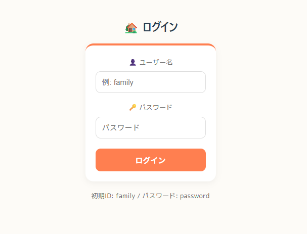
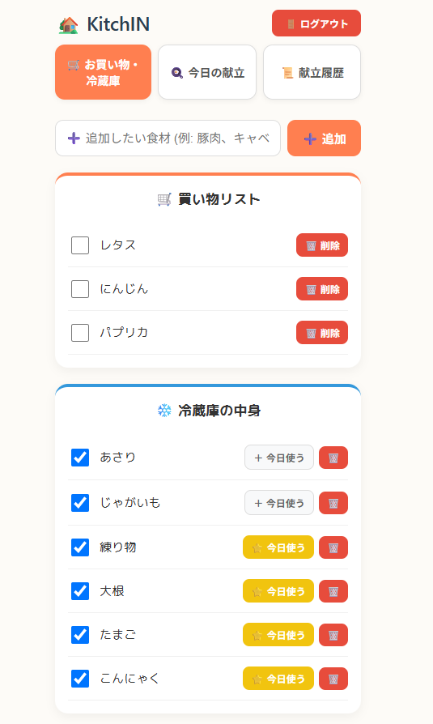
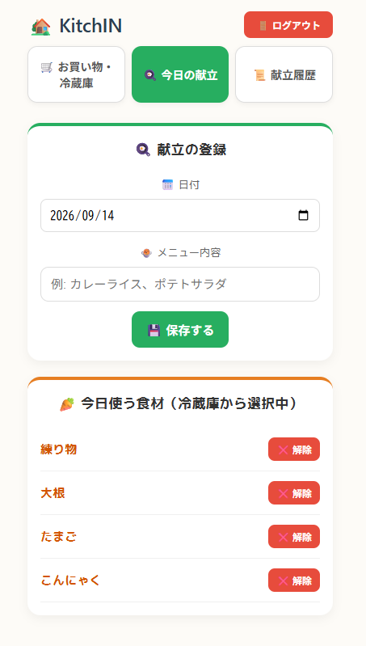
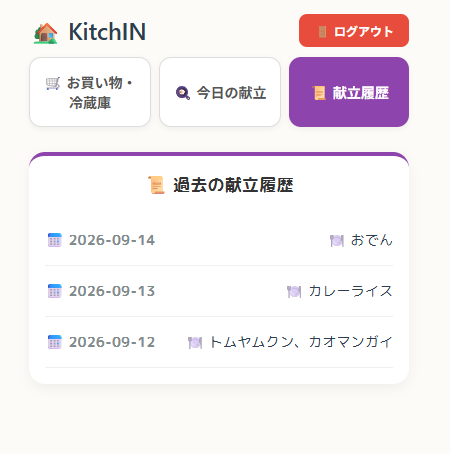

# 🏡 KitchIN（キッチン）

**家族の「何買う？」「何使う？」をわかりやすく可視化する、お買い物＆献立管理アプリ**

## 📌 アプリケーション概要
KitchINは、日々の食材の買い出し管理と献立の記録を共有できるアプリケーションです。
冷蔵庫の中身や買い物リスト、毎日の献立を一元管理し、毎日の料理の際のストレスを減らします。

- **アプリケーションURL**: https://kitchin-frontend.onrender.com
- **テスト用ログイン情報**
  - ユーザー名：`family`
  - パスワード：`password`

---

## 💡 開発した背景や理由

### 忙しい日常の小さなストレスを解消するために
日々の忙しい生活を送る中で、「あれ？うちになにがあったっけ？」「今日使う食材はどれだっけ？」という小さな悩みはつきものです。
趣味として料理を楽しむ一方で、仕事や家事と並行しながら毎日すべての冷蔵庫の在庫や献立の予定を把握し続けることは、想像以上に大変だと感じていました。

### 料理へのハードルを下げ、楽しい食卓へ
「もっと気軽に料理できたらいいのに」「買い忘れやフードロスを減らしたい」「日々の節約にもつなげたい」
そんな思いから、毎日の料理に対するハードルをぐっと下げるツールを目指しました。
複雑な操作をなくし、「楽しく、簡単に。」を合言葉に、心に余裕を持った豊かな生活をサポートしたいという思いを込め、開発しました。

## 📸 アプリケーションの画面と主な機能

### 1. ログイン画面


スマホからもスムーズに操作しやすい、シンプルで分かりやすいログイン画面です。

### 2. お買い物・冷蔵庫画面


冷蔵庫の在庫やお買い物リストを直感的に管理できます。今日使うものへの移動も簡単な操作で行えます。

### 3. 今日の献立・使うもの画面


毎日の献立決めをサポートし、今日作るものに合わせて必要な食材をスムーズに準備しやすい画面です。

### 4. 献立履歴画面


過去に作った献立の記録が一括で見やすく表示されるため、「先週何を作ったっけ？」というときの振り返りに便利です。

## 🛠️ 使用技術

### フロントエンド
- **React (Vite)**
- JavaScript / CSS

### バックエンド
- **Java (Spring Boot)**
- REST API

### データベース & インフラ・デプロイ
- **Render**（フロントエンド・バックエンドのホスティング/デプロイ）
- Git / GitHub（バージョン管理）

## セットアップ

### 必要環境
- Node.js
- Java (JDK)
- Git

### インストール手順

```bash
# 1. リポジトリをクローン（例：フロントエンドの場合）
git clone [https://github.com/tsukiame94-spec/kitchin-frontend.git](https://github.com/tsukiame94-spec/kitchin-frontend.git)
cd kitchin-frontend

# 2. バックエンドの起動 (Spring Boot)
# ※バックエンドのリポジトリを別途クローンしている場合のパスに合わせて調整してください
cd family-backend
./gradlew bootRun

# 3. フロントエンドの起動 (React / Vite) ※別のターミナルで実行
cd family-frontend
npm install
npm run dev

